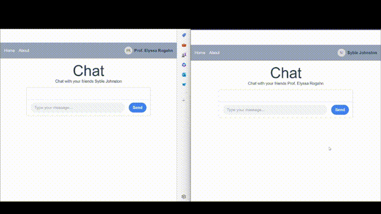

# realtime-chat-socketio

## This is a simple realtime chat application using Laravel and SocketIO. It is a simple chat application that allows users to send messages to each other.

### VueJS is used for the frontend [Repository Link](https://github.com/amr3del/realtime-chat-socketio-vue)

